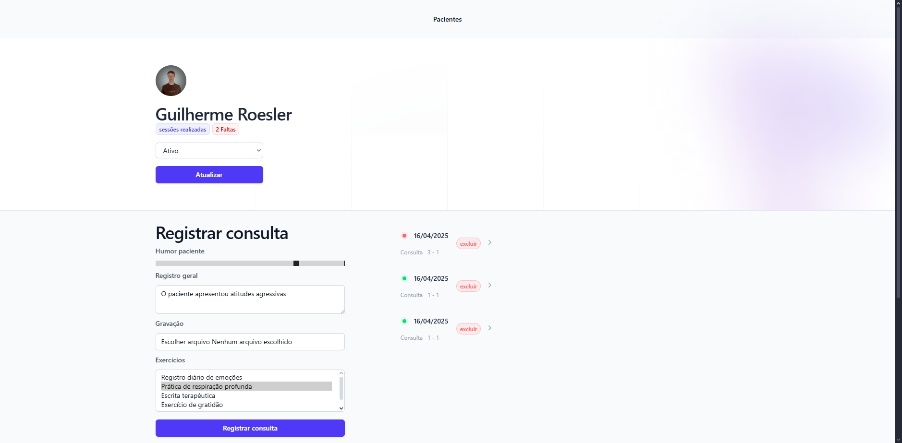

# PsycoManager

O **PsycoManager** é um sistema web desenvolvido em Django para auxiliar psicólogos na gestão dos seus pacientes, consultas e tarefas terapêuticas. O sistema permite o registo detalhado de sessões, incluindo o upload de gravações de vídeo, notas de registo geral e acompanhamento do humor do paciente.



## 🚀 Funcionalidades

### Gestão de Pacientes

- **Cadastro Completo:** Registo de nome, e-mail, telefone e foto do paciente.
- **Queixas Principais:** Classificação por tipo de queixa (TDAH, Depressão, Ansiedade, TAG).
- **Status de Pagamento:** Controlo visual de pacientes ativos (pagamento em dia) ou inativos.

### Gestão de Consultas

- **Registo de Sessão:** Armazenamento de dados da consulta, incluindo:
  - Escala de humor do paciente (1 a 5).
  - Registo geral (anotações da sessão).
  - Upload de vídeo da consulta.
- **Atribuição de Tarefas:** Associação de exercícios e tarefas terapêuticas à consulta.
- **Histórico:** Visualização cronológica das sessões realizadas.

### Funcionalidades Especiais

- **Consulta Pública:** Geração de um link partilhável para o paciente visualizar a sua consulta (vídeo e tarefas), protegido pela verificação de pagamento em dia.
- **Contador de Visualizações:** Monitorização de quantas vezes o link público foi acedido (total e IPs únicos).
- **Dashboard Visual:** Interface moderna estilizada com Tailwind CSS.

## 🛠️ Tecnologias Utilizadas

- **Python 3**
- **Django 5** (Framework Web)
- **SQLite** (Base de dados padrão)
- **Tailwind CSS** (Estilização via CDN)
- **HTML5 / CSS3**

## 📦 Como Instalar e Executar

Siga os passos abaixo para configurar o projeto no seu ambiente local:

### 1. Clonar o repositório

```bash
git clone https://github.com/GuilhermeRoesler/PsycoManager
cd psycomanager
```

### 2. Criar e ativar um ambiente virtual

```bash
# Windows
python -m venv venv
venv\Scripts\activate

# Linux/macOS
python3 -m venv venv
source venv/bin/activate
```

### 3. Instalar as dependências

O projeto requer o Django e o Pillow (para gestão de imagens).

```bash
pip install -r requirements.txt
```

### 4. Realizar as migrações da base de dados

```bash
python manage.py makemigrations
python manage.py migrate
```

### 5. Executar o servidor

```bash
python manage.py runserver
```

O projeto estará disponível em: `http://127.0.0.1:8000/pacientes/`

## ⚙️ Configuração Adicional

- **Superuser:** Para aceder ao painel administrativo (`/admin/`), crie um superutilizador:

```bash
python manage.py createsuperuser
```

## 📂 Estrutura do Projeto

- `core/`: Configurações principais do projeto (settings, urls).
- `pacientes/`: Aplicação principal contendo a lógica de views, modelos e templates.
- `templates/`: Arquivos HTML base.
- `media/`: Diretório onde são salvos os uploads (fotos de perfil e vídeos das consultas).

## 📄 Licença

Este projeto é de uso livre para fins de aprendizagem e desenvolvimento.
